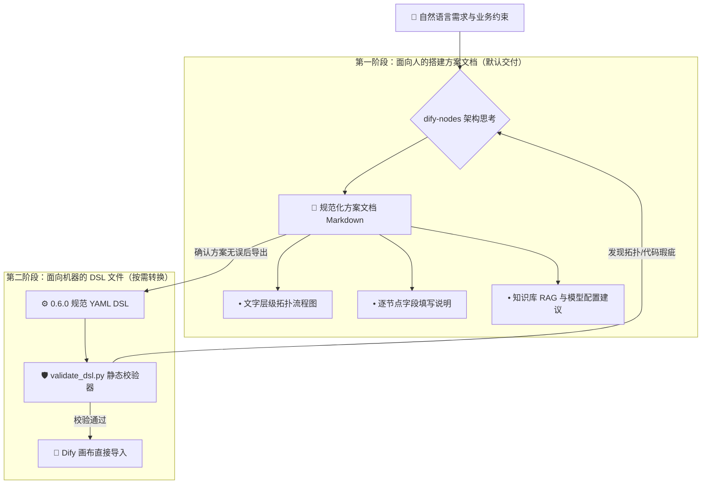

<div align="center">

<!-- [占位] 顶部主视觉横幅：建议 1200x420 宽屏科技蓝风格，详见 assets/README.md -->
<!--  -->

# ⚡ Dify Nodes

<p align="center">
  <b>企业级 Dify 工作流与 Chatflow 架构设计 Agent 技能 (Visual Flow Architect & DSL Copilot)</b><br>
  从自然语言需求对话，到逐节点搭建指南与一键导入 DSL。内置 27 类全节点 Schema 与 AST 静态安全校验。
</p>

<p align="center">
  
  
  
  
  
</p>

<p align="center">
  <a href="#-核心代差"><b>💡 核心代差</b></a> •
  <a href="#-双层交付流程"><b>🔄 交付体系</b></a> •
  <a href="#-节点矩阵"><b>🧩 27 类节点</b></a> •
  <a href="#-极速安装"><b>🚀 极速安装</b></a> •
  <a href="#-实战姿势"><b>💬 实战姿势</b></a> •
  <a href="#-静态校验器"><b>🛡️ 静态校验</b></a>
</p>

</div>

---

## ⚡ 核心代差 (Why Dify-Nodes)

<!-- [占位] 终端交互动图演示：详见 assets/README.md -->
<!-- <div align="center"></div> -->

| 维度 | 传统手动在 Dify 画布盲配 | 使用 `dify-nodes` 智能架构 | 生产力收益 |
| :--- | :--- | :--- | :--- |
| **画布搭建门槛** | 面对复杂分支不知选什么节点、字段填错频频报错 | 智能提炼需求，先出**逐节点人类可读搭建指南**，照着填 100% 成功 | **降低 90%** 认知负担 |
| **变量 Handle 对齐** | 手动连线常选错 Source/Target Handle，隐蔽 Bug 难排查 | 自动管理拓扑连线与 Handle 规范，严格保证上游输出与下游引用对齐 | **杜绝** 脏连接与死循环 |
| **Python 代码节点** | 上线后才发现命中沙箱禁用模块、未按 `def main` 签名 | 本地集成 **AST 代码节点语法检查**，提前拦截非法导入与输出缺失 | **零线上** 沙箱运行时崩溃 |
| **资产版本化交付** | 画布无法做 Git 代码审查，多人协作容易互相覆盖 | 原生支持一键导出标准 `version: 0.6.0` DSL YAML，代码化沉淀与复用 | **实现** 工作流版本可控 (Flow-as-Code) |

---

## 🔄 双层交付体系 (Two-Tier Delivery)

告别“黑盒直接塞 DSL 导致租户配置不对报错”。`dify-nodes` 采用严格的两阶段分层交付设计：



1. **第一阶段：搭建方案文档（默认交付）**：面向使用者的实操手册，不依赖导入权限。包含清晰缩进的文本拓扑、每个节点具体的参数填法与提示词建议，任何人都能照着在画布上搭建。
2. **第二阶段：DSL 导出文件（可选交付）**：生成完全合规的 `version: "0.6.0"` YAML。涉及租户专有资源（如知识库 ID、自定义工具、凭据）时，自动采用清晰占位符并明确批注导入后的补配清单。

---

## 🧩 覆盖全量 27 类 Dify 节点 Schema

内置从 Dify 官方源码深度解析提炼的完整节点配置规范、输出变量映射与避坑要点：

<details open>
<summary><b>展开查看 27 类节点支持矩阵</b></summary>

| 分类 | 节点类型 (`node_type`) | 核心能力与关键配置 |
| :--- | :--- | :--- |
| **起始与终止** | `start` / `end` | 入参类型定义、多分支最终响应聚合输出 |
| **AI 核心驱动** | `llm` / `agent` / `chat` | 提示词模板参数、视觉多模态输入、Function Calling 机制 |
| **知识与检索** | `knowledge-retrieval` | 检索模式（向量/全文/混合）、Rerank 重排序阈值与分块引用 |
| **逻辑与路由** | `if-else` / `iteration` / `question-classifier` | 复杂条件分支运算符、数组迭代循环、意图分类与快速路标 |
| **数据处理与代码** | `code` / `template-transform` / `variable-assigner` | Python/JS 安全沙箱限制校验、Jinja2 模板渲染、多轮会话状态管理 |
| **高级转换与工具** | `http-request` / `tool` / `document-extractor` | 第三方 REST API 鉴权、插件扩展、纯文本提取与富媒体解析 |

</details>

---

## 🚀 极速安装 (Quickstart)

### 姿势一：AI 助手一键安装（推荐）

直接复制以下指令发给你的日常 Agent（Claude Code、ZCode、Codex、Cursor 等）：

```text
请帮我安装这个 Agent Skill: https://github.com/guxiao7538/dify-nodes
下载后放入你的技能目录，读取其中的 SKILL.md 并按其规范工作。
```

### 姿势二：手动归档引入

```bash
# 克隆到本地 Agent Skill 搜索目录
git clone https://github.com/guxiao7538/dify-nodes.git ~/.claude/skills/dify-nodes
# 或针对项目级引入
git clone https://github.com/guxiao7538/dify-nodes.git .claude/skills/dify-nodes
```

---

## 💬 场景化实战姿势 (Usage Scenarios)

无论是从零搭建、格式转换，还是既有 DSL 疑难杂症排查，只需自然对话：

```markdown
# 场景 1：从零梳理搭建方案
用户: "我想做一个客服 Chatflow，要求先做问题意图分类，售后问题走知识库 RAG，投诉走人工通知，最后格式化输出。"
助手: [输出标准搭建方案文档：包含文字拓扑流程图、逐节点配置表与知识库参数建议]

# 场景 2：将既有方案导出为 DSL
用户: "确认方案，帮我转成可以直接导入 Dify 的 DSL 文件。"
助手: [生成符合规范的 workflow.yml，并自动调用校验脚本把关]

# 场景 3：DSL 故障体检与修复
用户: "我导入这个 workflow.yml 提示节点连线错误或代码节点报错，帮我看看哪里写错了。"
助手: [运行 validate_dsl.py 定位 Handle 不一致或 Python 沙箱违规，给出修复版 YAML]
```

---

## 🛡️ Python AST 静态校验器 (Validator)

项目内置独立的离线校验工具 `scripts/validate_dsl.py`，无需联网或启动 Dify 后端即可提前拦截 95% 以上的导入阻断：

```bash
# 使用 uv 极速执行（无需预装依赖）
uv run --with pyyaml python3 scripts/validate_dsl.py your-workflow.yml

# 或使用标准 pip
pip install pyyaml && python3 scripts/validate_dsl.py your-workflow.yml
```

### 校验防御项目一览：
- [x] **拓扑完整性**：节点/边基础结构、起始/终止节点闭环、Handle 命名空间一致性。
- [x] **引用追溯**：遍历所有节点的变量选择器，确保引用的上游节点与变量真实存在。
- [x] **Python 代码节点合规**：
  - 强制 `def main(...)` 签名合法性检查。
  - 函数参数名与节点声明的输入变量名严格一对一映射。
  - 静态 AST 检查返回值是否包含全部声明的 `outputs` 键名与类型。
  - 拦截已被 Dify 沙箱禁用的非白名单模块调用。

---

## 📁 架构与文件结构

```text
dify-nodes/
├── SKILL.md                      # Agent 工作流程与硬规则顶层入口
├── assets/                       # 视觉资源与 Banner 占位规范
│   └── README.md
├── references/                   # 核心专业领域知识库
│   ├── node-schemas.md           # 27 种全节点详细配置、输出变量与避坑要点
│   ├── code-node.md              # 代码节点专项（沙箱限制、预装包、标准模板）
│   ├── dsl-structure.md          # 0.6.0 DSL 拓扑规范、依赖与敏感字段标注
│   └── solution-template.md      # 标准人读方案文档模板与流程图规范
└── scripts/
    └── validate_dsl.py           # Python 离线 AST 校验工具
```

---

## 📄 开源许可证

本项目采用 [MIT](LICENSE) 开源许可证。欢迎提 Issue 与 PR 共同扩充最新 Dify 节点特性！
